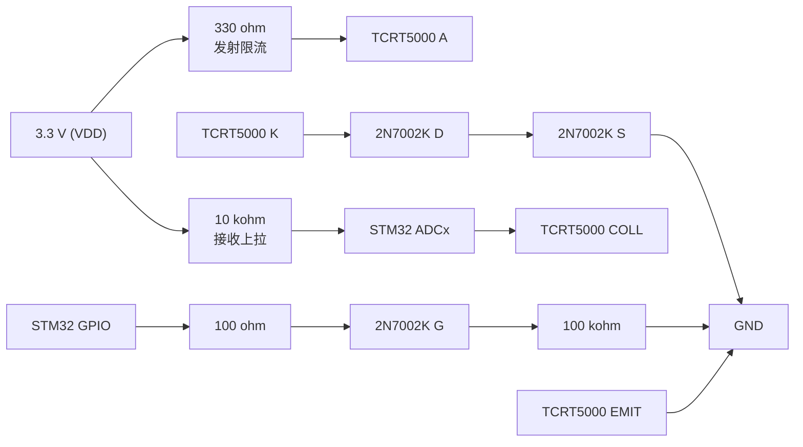

# 红外反射传感器测试：电路连接说明

## 1. 适用范围与重要说明

本说明基于当前 KiCad 工程的实际原理图：

- 传感器：8 路 `TCRT5000` 反射式红外传感器，位号 `U1` 至 `U8`；
- 主控：`STM32G0B1RBT6`，原理图位号 `U10`；
- 供电：USB 5 V 经 `AMS1117-3.3` 生成 `VDD = 3.3 V`；
- 串口：`CH340N` 与 STM32 的 `USART1` 相连。

## 2. 单路电路

每一路均由发射驱动和接收采样两部分构成。

### 工作逻辑

1. STM32 的 GPIO 输出高电平，TCRT5000导通，红外发射管点亮。
2. 白纸或高反射区域使光电三极管导通更强，`COLL` 节点被拉向 GND，ADC 电压通常降低。
3. 黑纸或低反射区域使光电三极管导通更弱，`COLL` 节点由 10 kohm 上拉，ADC 电压通常升高。
4. 黑白读数的极性受实物安装、环境光和纸张反射率影响；测试程序只需确认两种目标的均值存在稳定差异，不应预先假定哪一者数值更大。

发射 LED 的近似电流为：

$$
I_\mathrm{LED} \approx \frac{3.3\ \mathrm{V} - V_\mathrm{F} - V_\mathrm{DS(on)}}{330\ \Omega}
$$

其中 $V_\mathrm{F}$ 和 $V_\mathrm{DS(on)}$ 以实物数据手册和测试值为准。初次验证采用单通道、低占空比点亮，避免同时点亮 8 路造成互扰和不必要的电流消耗。

## 3. 当前原理图的通道映射

| 通道 | 传感器 | ADC 输入 | STM32 引脚    | LED 控制网络 | STM32 引脚    | 发射限流 / 接收上拉           |
| ---- | ------ | -------- | ------------- | ------------ | ------------- | ----------------------------- |
| CH0  | U1     | ADC1_IN0 | PA0（U10-17） | GPIO_0       | PD0（U10-50） | R1 = 330 ohm / R2 = 10 kohm   |
| CH1  | U2     | ADC1_IN1 | PA1（U10-18） | GPIO_1       | PD1（U10-51） | R3 = 330 ohm / R4 = 10 kohm   |
| CH2  | U3     | ADC1_IN2 | PA2（U10-19） | GPIO_2       | PD2（U10-52） | R5 = 330 ohm / R6 = 10 kohm   |
| CH3  | U4     | ADC1_IN3 | PA3（U10-20） | GPIO_3       | PD3（U10-53） | R7 = 330 ohm / R8 = 10 kohm   |
| CH4  | U5     | ADC1_IN4 | PA4（U10-21） | GPIO_4       | PD4（U10-54） | R17 = 330 ohm / R18 = 10 kohm |
| CH5  | U6     | ADC1_IN5 | PA5（U10-22） | GPIO_5       | PD5（U10-55） | R19 = 330 ohm / R20 = 10 kohm |
| CH6  | U7     | ADC1_IN6 | PA6（U10-23） | GPIO_6       | PD6（U10-56） | R21 = 330 ohm / R22 = 10 kohm |
| CH7  | U8     | ADC1_IN7 | PA7（U10-24） | GPIO_7       | PD8（U10-40） | R23 = 330 ohm / R24 = 10 kohm |

每个 MOSFET 栅极还包含：

- 100 ohm 串联电阻：`R9` 至 `R12`、`R25` 至 `R28`；
- 100 kohm 下拉电阻：`R13` 至 `R16`、`R29` 至 `R32`。

下拉电阻保证 STM32 上电或复位时 LED 默认关闭。

## 4. 最小硬件连接

传感器验证不需要外接 USB 转串口模块，使用板上的 USB Type-B、CH340N 和 STM32 即可。

| 功能       | 板内连接                                     | 测试时的外部连接                         |
| ---------- | -------------------------------------------- | ---------------------------------------- |
| 供电       | USB VBUS -> AMS1117-3.3 -> VDD               | USB Type-B 连接 Linux 主机               |
| 串口发送   | PC4 / USART1_TX -> CH340N RXD                | Linux 主机枚举出`/dev/ttyUSB*`         |
| 串口接收   | PC5 / USART1_RX <- CH340N TXD                | 初测可不发送 PC 到板命令                 |
| 调试下载   | PA13 / SWDIO、PA14 / SWCLK、NRST、3.3 V、GND | 接 ST-LINK 的 SWD 接口                   |
| 传感器表面 | U1 至 U8 窗口面向纸片                        | 用 2 mm 至 3 mm 厚的固定垫片保持纸面距离 |

## 5. 首次上电检查顺序

1. **不上电测量**：确认 `VDD` 与 `GND` 没有短路；确认 TCRT5000 和 2N7002K 极性、方向与 PCB 丝印一致。
2. **只接 USB 供电**：测量 `VDD`，应约为 3.3 V；不应持续明显发热。
3. **保留 SWD 下载器**：先下载只测试 `CH0` 的程序。
4. 程序只将 `PD0` 置高，读取 `PA0`；其余 LED 控制脚保持低电平。
5. 用白纸和黑纸依次覆盖 U1 窗口，保持相同距离，串口输出 ADC 原始值。
6. 单通道合格后，按 CH0 至 CH7 的顺序依次测试；测试一个通道时只点亮该通道。

## 6. CubeMX 引脚与外设配置

在 `AI_TRY_UART/AI_TRY_UART.ioc` 中保留现有 `USART1` 与 SWD 配置，并补充以下配置。

| 类别      | 配置                                                                |
| --------- | ------------------------------------------------------------------- |
| SYS       | 保持`Serial Wire`，即 PA13 = SWDIO、PA14 = SWCLK                  |
| USART1    | Asynchronous，PC4 = TX、PC5 = RX，115200-8-N-1                      |
| ADC1      | PA0 至 PA7 配置为`ADC1_IN0` 至 `ADC1_IN7`，12 bit，右对齐       |
| ADC1 初测 | 先只启用`IN0`，单次转换、软件触发、轮询读取                       |
| GPIO      | PD0 至 PD6、PD8 设为`GPIO_Output`，Push-Pull、No Pull、初始低电平 |
| 定时器    | 单通道确认后再启用一个基本定时器，例如 TIM3，以中断触发扫描节拍     |

对于 10 kohm 接收上拉电阻，ADC 采样时间不要选择最短值。先使用较长采样时间；若读数稳定且满足扫描速度，再逐步缩短采样时间。

## 7. 现有 CMake 工程

现有工程已由 CubeMX 生成 CMake 配置：
