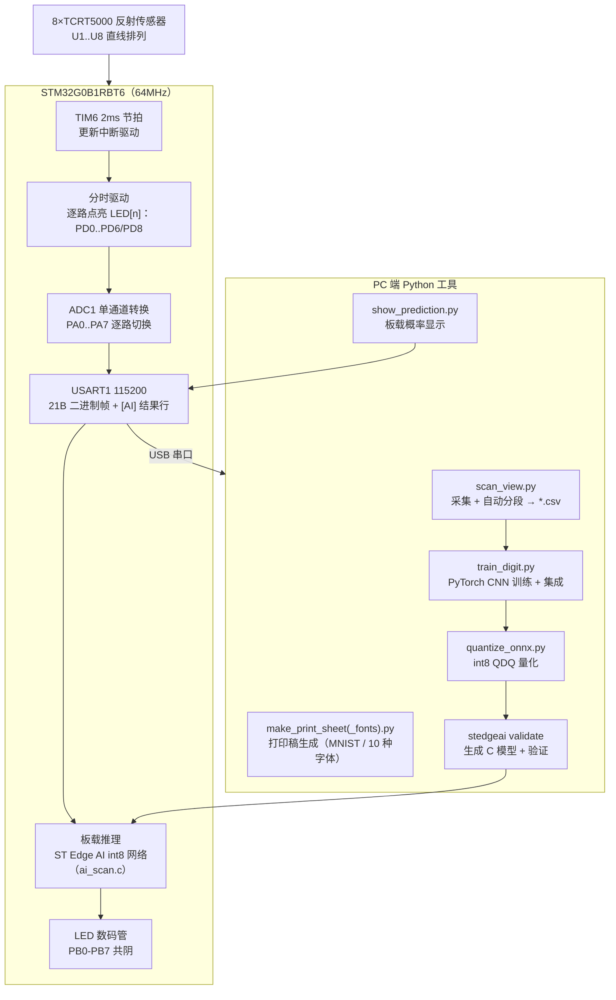

# AI_TCRT5000 — 文字识别器提交归档（STM32G0B1 + 8 路 TCRT5000）

基于《综合实验》任务书的**文字识别器**项目：用 **8 个 TCRT5000 红外反射传感器**排成一条直线，通过**定时器分时驱动 + ADC 采集**扫描纸片上的数字字符，数据经 **USB 串口**上送 PC；PC 端重建图像并训练识别模型，模型经 **ST Edge AI 量化为 int8** 部署到板载 **STM32G0B1RBT6**，扫描完成后**直接在单片机上推理**，结果经 **LED 数码管显示**（置信度≥30%，保持 5s）并通过串口输出 0-9 各数字概率。

本仓库为按开发阶段整理的**提交归档**：每个目录是一份独立快照（含必要依赖，可单独使用），供提交/存档/评审使用；开发中的完整工程（含 outputs/、docs/、print/ 等与全部 Git 历史）见主仓库 `-/my_project_ZSA/AI_TRY_TCRT5000`。

---

## 1. 系统概览



| 环节   | 方案                                                                                       |
| ------ | ------------------------------------------------------------------------------------------ |
| 传感器 | 8×TCRT5000（反射式红外），同一时刻仅 1 路发射管点亮（分时，消除串扰/低功耗）              |
| 采集   | ADC1 单通道转换（Scan Disabled），`HAL_ADC_ConfigChannel` 逐路切换；采样时间 79.5 cycles |
| 节拍   | TIM6 2ms（CubeMX 配置：PSC=64-1, Period=1999），更新中断驱动                               |
| 传输   | USART1 115200，二进制帧 21B（行号 + 8×u16 + 校验和），一行 8 通道 = 16ms ≈ 62.5 行/秒    |
| 推理   | ST Edge AI int8 网络（权重 22.4KB、激活 8KB），扫描完成自动板载推理                        |
| 显示   | 单 LED 数码管（PB0-PB7 共阴），置信度 ≥30% 显示预测数字并保持 5s                          |

---

## 2. 仓库结构

| 目录                              | 内容                                                                                                                             | 阶段/状态           |
| --------------------------------- | -------------------------------------------------------------------------------------------------------------------------------- | ------------------- |
| `AI_TCRT5000_ScanData/`         | **扫描部分**：采集固件工程（TIM6 分时驱动 + ADC + 串口二进制帧）+ 任务书/电路说明文档                                      | 第一阶段，已完成 ✅ |
| `Dataset/`                      | **最新数据集**：0-9 各 30 个扫描 CSV（共 **300** 样本 = MNIST 打印体 01-20 + 10 种标准字体 21-30）                   | 最新版              |
| `Model_v1/`                     | **第一版模型**：200 样本、随机 14/3/3 划分的训练/量化脚本 + C 模型 + 产物与可行性报告                                      | 历史存档（V1）      |
| `Model_v2/`                     | **最新版模型**：300 样本、固定划分 20/5/5 的训练/评估/量化脚本 + 第二轮 int8 C 模型 + 产物/数据/图片与报告                 | 最新版（部署）      |
| `Python_Tools/`                 | **最新 Python 工具**：采集/渲染/打印稿/训练/评估/体检/量化/验证/显示 全套 12 个                                            | 最新版              |
| `AI_TCRT5000_CHAR_RECOGNITION/` | **最新单片机工程**：当前完整固件（采集 + 板载推理 + 数码管显示，可构建），CubeMX 工程 `AI_TCRT5000_CHAR_RECOGNITION.ioc` | 最新版（部署固件）  |

---

## 3. 各目录详解

### 3.1 AI_TCRT5000_ScanData — 扫描部分（第一阶段）

数据采集阶段快照，对应主仓库提交 a55f613：

- `Core/`：采集固件（`main.c` 分时驱动 / ADC 采集 / 二进制帧组帧；tim/adc/usart/gpio 由 CubeMX 生成）
- `Drivers/ cmake/ *.ioc *.ld startup`：CubeMX 工程与 CMake 构建配置
- `docs/`：`Question.md`（任务书）、`传感器测试_任务书.md`、`传感器测试_电路连接说明.md`

### 3.2 Dataset — 数据集（300 样本）

`datasets/<digit>_scan/<digit>-NN.csv`：数字 0-9 各 30 个，共 **300 个扫描样本**。

- 每文件 = 一张独立纸片的一次扫描（8 通道 ADC 原始值 0-4095；白纸=低值、黑墨=高值），行格式 `row,ch0..ch7`，行数 22-118（人工扫描快慢不同）；
- 命名：`NN = 01-20` 为 **MNIST 打印体**，`21-30` 为 **10 种标准字体**（DejaVu/Liberation/URW/C059 等，`make_print_sheet_fonts.py` 生成打印稿后扫描）；
- **固定划分**（新旧字体按比例混入各集合）：训练 = 1-14 + 21-26、验证 = 15-17 + 27-28、测试 = 18-20 + 29-30（每类 20/5/5），划分清单见 `Model_v2/artifacts/split_fixed.json`；
- 质量复检：`Python_Tools/tools/check_samples.py`（黑边/墨量/截断/留出误判分析）。

### 3.3 Model_v1 — 第一版模型（历史存档）

200 样本、**随机 14/3/3** 划分，对应主仓库提交 ab5cc66 - ba4d883：

- `python/`：`train_digit.py`（PyTorch 微型 CNN 22.6k 参数 + LS/WD + 集成 + ONNX 导出）、`preprocess.py`、`quantize_onnx.py`、`export_ai_studio_data.py`、`check_samples.py`
- `c/`：ST Edge AI 生成的 int8 C 模型（`Network/`）+ 运行时（`Middlewares/ST/AI/`）
- `artifacts/`：`model_best.pt`/`model_final.pt`、`model.onnx`/`model_best_int8.onnx`、`ai_studio_test.npz`、`summary_{baseline,enhanced,ensemble}.json`、`training_log.csv`、`curves.png`/`confusion_matrix.png`、`识别可行性测试报告.md`
- 结果：基线 **75.3%±4.0%** → LS+WD **81.3%±6.5%**（5 划分）、多 seed 投票 **83.3%**；部署模型测试 **76.67%**（30 样本），int8 与 float32 均 76.67%（零精度损失）。

### 3.4 Model_v2 — 最新版模型（部署）

300 样本、**固定划分 20/5/5**，对应主仓库提交 5553da2 / 56390ac / 314c0c0：

- `python/`：`train_digit.py`（`--split fixed` + LS/WD + 5 seed 集成 + ONNX 导出）、`preprocess.py`、`eval_model.py`、`check_samples.py`、`export_ai_studio_data.py`、`quantize_onnx.py`
- `c/`：**第二轮 `stedgeai generate-2` 生成的 int8 网络**（`Network/`，权重 22,928B）+ 运行时（`Middlewares/ST/AI/`）
- `artifacts/`：`model_best.pt`（部署模型 seed 1042）、`models_seed{42,1042,2042,3042,4042}.pt`（5 个集成模型）、`model.onnx`/`model_best.onnx`/`model_best_int8.onnx`、`ai_studio_test.npz`、`split_fixed.json`、`summary_fixed_repeats.json`/`summary_fixed_ensemble.json`/`train_summary.json`、`training_log.csv`、`curves.png`/`confusion_matrix.png`/`preprocess_grid.png`、`识别可行性测试报告.md`（含第一轮 §1-§9 与第二轮 §10-§11）
- 结果：5 seed 测试 **81.2%±1.0%**、多数投票 **88.0%**；部署模型测试 **82.0%**（50 样本）；新字体（域外）识别 **94%**；int8 零精度损失（stedgeai validate：rmse=0、nse=1.0、cos=1.0）。

### 3.5 Python_Tools — 工具链（12 个）

与主仓库 `tools/` 一致的最新版：

| 工具                          | 功能                                                                            |
| ----------------------------- | ------------------------------------------------------------------------------- |
| `scan_view.py`              | 串口采集 + 按"数据恢复 4095"自动分段，每字符存一个 CSV                          |
| `show_scan.py`              | CSV 渲染颜色深度图（`--thresh` 纯黑白二值化）                                 |
| `make_print_sheet.py`       | MNIST 打印稿生成（反色 + 加粗 + A4 排版；torchvision/gz 双数据源）              |
| `make_print_sheet_fonts.py` | **字体版打印稿生成**（10 种系统标准字体，编号 x-21-x-30）                 |
| `check_quality.py`          | 扫描 CSV 质量体检（早期版本）                                                   |
| `preprocess.py`             | 预处理管线：无纸电平黑边 v2 裁剪 + 固定高度重采样（32×8）+ 逐样本归一化 + 增强 |
| `train_digit.py`            | PyTorch 微型 CNN 训练 0-9（固定划分 + LS/WD + 多 seed 集成 + ONNX 导出）        |
| `eval_model.py`             | 用已训练模型评估指定扫描集（新数据复测）                                        |
| `check_samples.py`          | 样本质量体检 + 留出误判分析（建议重扫清单）                                     |
| `export_ai_studio_data.py`  | 导出 ST Edge AI 验证 .npz（x_test + one-hot y_test，形状 (N,1,1,10)）           |
| `quantize_onnx.py`          | ONNX int8 QDQ 静态量化（→ model_best_int8.onnx）                               |
| `show_prediction.py`        | 串口监听，解析`[AI]` 概率行，终端条形图显示预测 + 历史                        |

依赖：numpy / torch(CPU) / matplotlib / pyserial / onnx / onnxruntime（按需）。

### 3.6 AI_TCRT5000_CHAR_RECOGNITION — 最新单片机工程（部署固件）

当前完整固件，可构建（对应主仓库提交 314c0c0 的第二轮 int8 固件）：

- `Core/Src/main.c`：采样主循环（TIM6 分时驱动 + ADC 采集 + 二进制帧上送）
- `Core/Src/ai_scan.c`：**板载 AI 模块**——扫描缓冲/结束检测、预处理（黑边裁剪→重采样 32 行→归一化→int8 量化）、`stai_network_run` 推理、softmax、串口概率输出、数码管驱动
- `Core/Src/seg_display.c`：单 LED 数码管驱动（PB0-PB7 共阴）
- `Network/`：ST Edge AI 生成的 int8 网络（2026-08-27 generate-2，权重 22.4KB）
- `Middlewares/ST/AI/`：ST Edge AI 运行时（头文件 + CM0+ 运行库）
- `ref/AI_TRY_SEG/`：数码管参考工程
- `AI_TCRT5000_CHAR_RECOGNITION.ioc`、`Drivers/`、`cmake/`、`CMakeLists.txt`、`CMakePresets.json`、`startup_stm32g0b1xx.s`、`STM32G0B1xx_FLASH.ld`：CubeMX 工程与 CMake 构建/调试配置
- 资源占用：**Flash 53.10%**（69604 B / 128 KB）、**RAM 12.04%**（17752 B / 144 KB）

> **模型更新说明**：更换模型只需替换 `Network/` 下 4 个文件（`network*.c/h`、`network_data.c/h`），`ai_scan.c` 无需改动（API 不变，输出反量化 scale 由 `network.h` 的 `STAI_NETWORK_OUT_1_SCALE` 宏自动更新）。

---

## 4. 关键结果

### 4.1 第一版 vs 最新版对比

| 指标                    | Model_v1（200 样本，随机 14/3/3） | Model_v2（300 样本，固定 20/5/5） |
| ----------------------- | --------------------------------- | --------------------------------- |
| 测试集规模              | 30 样本                           | 50 样本                           |
| 单模型测试均值          | 81.3% ± 6.5%                     | 81.2% ± 1.0%                     |
| 多数投票（PC 端）       | 83.3%                             | **88.0%**                   |
| 部署模型测试            | 76.67%                            | **82.0%**                   |
| 新字体（域外）识别      | 16% / 52%                         | **94%**                     |
| int8 部署精度损失       | 零                                | 零                                |
| 固件资源（Flash / RAM） | 53.1% / 12.0%                     | 53.10% / 12.04%                   |

### 4.2 关键结论

- **采集链路完整可用**：8 路传感器读数正常（白纸=低值 -764-1500，黑墨=高值 -4095）；实测扫描 96 行/字符，帧同步/校验和/自动分段全部验证通过；
- **PC 识别训练可行**：固定划分（新旧字体混合）5 seed 重复实验测试 **81.2%±1.0%**，多 seed 投票 **88.0%**；
- **字体域偏移已解决**：旧模型（仅 MNIST 打印体训练）识别新字体版样本仅 **16%（0-4）/ 52%（5-9）**；固定划分新旧字体混合重训后，部署模型对新字体样本识别率 **94%**；
- **板载部署验证通过**：int8 量化零精度损失（权重 22.4KB、激活 8KB），`stedgeai validate` 50 样本 **82.0%**，C 模型与参考模型数值一致（rmse=0、nse=1.0、cos=1.0）；固件 Flash 53.10% / RAM 12.04%；
- 完整测试报告见 `Model_v2/artifacts/识别可行性测试报告.md`。

---

## 5. 快速开始

### 5.1 固件构建与烧录（Linux，需 arm-none-eabi-gcc + cmake + ninja）

```bash
cd AI_TCRT5000_CHAR_RECOGNITION
cmake --preset Debug && cmake --build --preset Debug
openocd -f interface/stlink.cfg -f target/stm32g0x.cfg \
        -c "program build/Debug/AI_TCRT5000_CHAR_RECOGNITION.elf verify reset exit"
```

### 5.2 采集字符数据（PC）

```bash
pip install pyserial
python3 Python_Tools/tools/scan_view.py /dev/ttyUSB0 --image   # 或 Windows: ... COM3
```

操作：扫一个字符 → 拿开纸片等数据恢复 4095 → 扫下一个；CSV 自动存入 `outputs/`。

### 5.3 训练与评估（PC）

```bash
python3 Model_v2/python/train_digit.py --split fixed --repeats 5    # 固定划分重复实验
python3 Model_v2/python/train_digit.py --split fixed --ensemble 5   # 多 seed 投票 + ONNX 导出（部署模型）
python3 Model_v2/python/eval_model.py --digits 0-4 --seq 21-30      # 用已保存模型评估新字体样本（复测）
```

### 5.4 ST Edge AI 验证与 int8 量化（PC）

```bash
python3 Model_v2/python/export_ai_studio_data.py    # 生成验证数据 ai_studio_test.npz
python3 Model_v2/python/quantize_onnx.py            # ONNX int8 量化 → model_best_int8.onnx
stedgeai validate --model <int8.onnx> --valinput <ai_studio_test.npz> \
  --classifier --mode host --name network --target stm32g0 --workspace <ws> --output <out>
# 生成的 C 代码替换 AI_TCRT5000_CHAR_RECOGNITION/Network/（见 §3.6 模型更新说明）
```

### 5.5 查看板载推理结果（PC）

```bash
python3 Python_Tools/tools/show_prediction.py /dev/ttyUSB0
```

烧录板载 AI 固件后，扫描数字并拿开纸片，终端即显示 10 类概率条形图与最近历史。

---

## 6. 串口协议

一行 = 一次 8 通道采样（21 字节二进制帧）：

```
[0xAA][0x55][行号 u16 LE][CH0..CH7 × u16 LE][校验和 u8]     共 21 字节
校验和 = 字节 2..19 之和 & 0xFF
```

- 行号自增，相邻行间隔 16ms（TIM6 2ms × 8 路）；极性：白纸=低值、黑墨=高值。

每次扫描结束（纸片离开），固件另输出一行**板载推理结果**（文本，与二进制帧共存）：

```
[AI] rows=56 best=9:94% | 0:0% 1:0% 2:0% 3:0% 4:0% 5:1% 6:0% 7:0% 8:5% 9:94%
```

`rows` = 扫描行数（裁剪前），`best` = 置信最高数字，其后为 0-9 的预测概率（整数百分比）。
